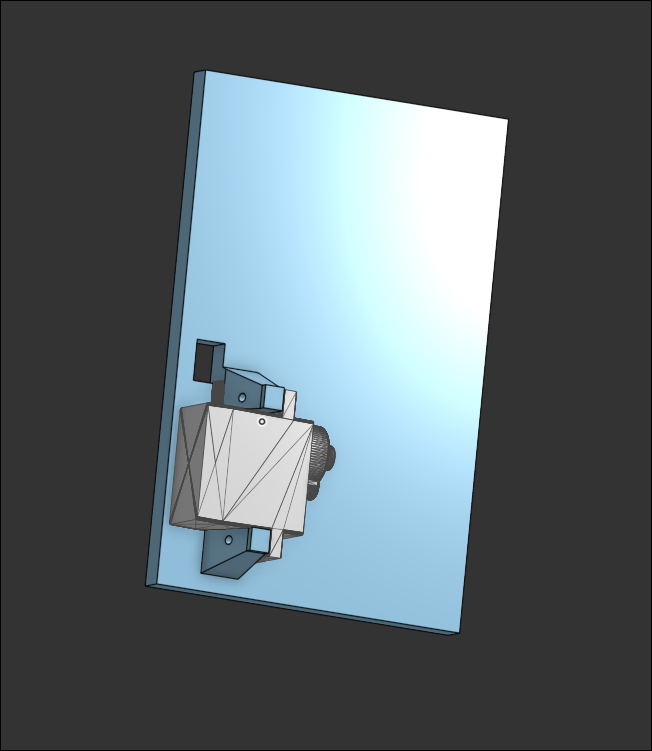
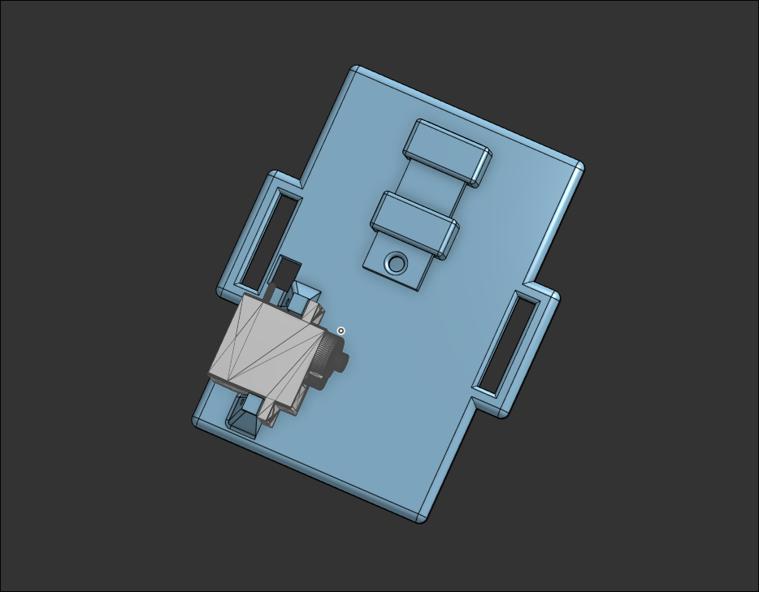
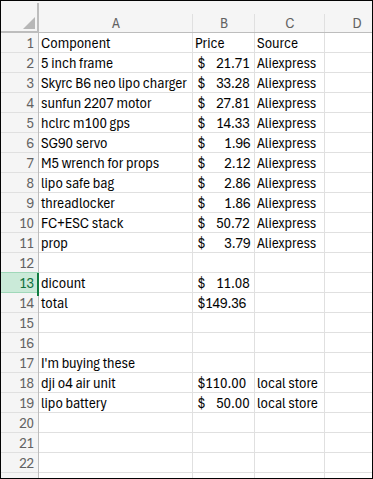

### **total hours: 21h**

# July 4th: Start!

I did research about components and sourced some components from aliexpress. I will use dji O4 air unit, xing 2207 motor, SG90 servo, 5 inch frame, M100 GPS, and Speedybee F450 stack. It took a while because components are expensive and i was trying to reduce cost as much as possible.

Also, I started to working on 3d modeling of servo payload system. I saw a video on youtube (https://www.youtube.com/shorts/8GbMEWLD8KA) which is simple payload system on fpv drone. I will benchmark this and make similar one. But I'm going to make it better and more refined because one in the video is made out of some random metal part and zip tie. I will use 3d printed part and possibly a metal part for stronger holder for smaller thickness.

I started looking and planning 3d model by looking at carbon fiber frame that i chose on aliexpress. I think i will mount servo on the backside of the drone and put locking system at the center of the drone for stability.

**Total time spent: 6h**

# July 5th: Component changes and 3d modeling start

I did more research and a lot of searching on aliexpress for cheaper materials. I found cheaper SG90 servo so i replaced it. and i also found similar frame for better price so i replaced it too. it doesn't include 3d printed parts but i can design and print them myself ig. I replaced speedybee stack to unknown branded but cheaper stack.

I restarted to plan 3d model again cuz i changed frame and I will use holes for holding top and bottom part together to hold 3d printed servo mount(I will use longer screw) and put servo on the mount. 

**Total time spent: 5h**

# July 6th: more component changes and 3d modeling again

I'm currently trying to reduce cost and it is so hard :(( Its 383$ now including dji O4 air unit lite. I'm trying to fit everything under 150$ without air unit and battery. I changed motor to sunfun 2207 1750kv which is cheaper.

I restarted 3d modeling AGAIN because i wanted the payload system be removable and modular since flight time can be extended if payload system is removable.
I'm planning to use fpv battery strap to hold 3d printed payload system onto the frame.

Currently, I made hole for wire and mount for servo motor. I'm planning to add strap hole on the left and right side.

### Current CAD

**Total time spent: 5h**

# July 8th: Finished CAD!!

I finished CAD part. I added holes for strap and lock part. idk if it will work perfectly. So i'm going to fix it if it doesnt work when i get the servo. the hole will work as pivot and i will use metal strip to connect motor and the hole.

### some sketches that i draw during modeling

**Total time spent: 2h**

# July 10th: Finished!!

Today. I worked on reducing cost again. I replaced some parts with cheaper alternative and applied sale coupon :) So it is under 150$ without air unit and battery

Also, I wrote BOM csv for submission.

**Total time spent: 3h**